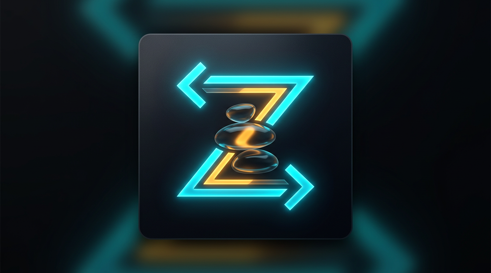

<div align="center">

# ⌘ Zen Workspace IDE

**The Ultimate Distraction-Free Command Center & AI Coding Companion**

[](https://opensource.org/licenses/MIT)
[](https://react.dev/)
[](https://www.electronjs.org/)
[](https://vitejs.dev/)
[](https://zustand-demo.pmnd.rs/)



</div>

---

## ⚡ Overview

Welcome to **Zen Workspace**, an Electron-based integrated development environment crafted from the ground up for elite engineers and power users. Designed using _Gemini Design Brain_ aesthetics—featuring deep `#050505` backgrounds, subtle glassmorphism, and precise spatial organization—Zen Workspace guarantees an unparalleled, distraction-free environment.

Stop wrestling with bloated IDEs. Enter the **Focus Terminal Environment**, where raw command-line power meets elegant orchestration.

## 🔥 Key Features

### 1. 🚀 Focus Terminal Environment

Our flagship feature. Create fully isolated workspaces containing a perfectly symmetric grid of your favorite AI CLI agents (`Terminal`, `Claude CLI`, `Codex CLI`, `Gemini CLI`, `Opencode CLI`).

- **Dynamic Node Grids:** Spin up 1, 2, 4, 6, or 8 synchronized terminal nodes within a beautifully designed configuration modal.
- **Background Persistence:** Terminals remain infinitely active. Toggling between your code, AI Chat, and other Workspaces **never** kills your processes.
- **Fluid Layouts:** Driven by Tailwind v4 `@container` queries, the entire dashboard breathes and scales seamlessly whether you are full-screen or splitting your view.

### 2. 🎵 Built-In Vibe Player

Say goodbye to context-switching just to change the song.

- Integrated floating `VibePlayer` seamlessly streams _Lofi_ or _Rain_ vibes.
- **Smart State Management:** Stays completely uninterrupted while you hop between Focus Terminal nodes and your codebase.
- **Voice-Activated AI Control:** Ask the built-in Gemini Assistant to _"Play The Weeknd playlist"_ and watch it magically load up the perfect background music.

### 3. 🧠 Zen AI Assistant

A built-in side-panel AI powered by the `Google Gemini 2.5 Flash` API.

- Code explanation, refactoring, and general problem-solving right next to your editor.
- **Smart History:** Remembers past discussions via robust `zustand/middleware` persistence.
- **Full File Awareness:** Feeds your currently active Editor file directly into the prompt context for hyper-accurate guidance.

### 4. 💻 Seamless Monaco Editor

Integrated `Monaco Editor` tuned with a custom `modern-dark` theme.

- Instant File explorer and workspace search capabilities.
- Dynamic tab-management aligned with the bottom boundary for a professional IDE feel.

---

## 📦 Installation & Setup

1. **Clone the Repository:**

```bash
git clone https://github.com/paul/zen-workspace-ide.git
cd zen-workspace-ide
```

2. **Install Dependencies:**

```bash
npm install
```

3. **Run the Development Server:**

```bash
npm run dev
```

4. **Build for Production:**

```bash
npm run build:linux   # For Linux (.AppImage, .deb, .snap)
npm run build:mac     # For macOS (.dmg)
npm run build:win     # For Windows (.exe)
```

---

## 🛠️ Usage Guide

- **Opening the Focus Terminal:**
  Click the `Terminal` icon on the Activity Bar. Double-click any active Workspace tab to rename it. Click the `+` button to spawn an entirely new multi-node CLI environment.
- **Playing Music:**
  Click the `Disc` icon in the Activity Bar to toggle the floating Vibe Player.
- **Interacting with AI:**
  Enter your Gemini API key via the `Assistant` tab to unlock the chat interface. Try saying _"Play some deep focus coding music"_.
- **Managing Files:**
  Use the `Explorer` tab to open local directories. Click on files to load them into the pristine Monaco Editor interface.

---

## 🏗️ Tech Stack

- **Framework:** React 19 + TypeScript + Vite
- **Desktop Environment:** Electron + Electron-Vite
- **State Management:** Zustand (with local persistence)
- **Styling:** TailwindCSS v4 + Lucide React Icons
- **Terminal:** Xterm.js + node-pty
- **Editor:** Monaco Editor (`@monaco-editor/react`)

---

<div align="center">
  <i>Crafted with precision for developers who demand focus.</i><br/>
  <b>Stay in the flow. Stay in Zen.</b>
</div>
